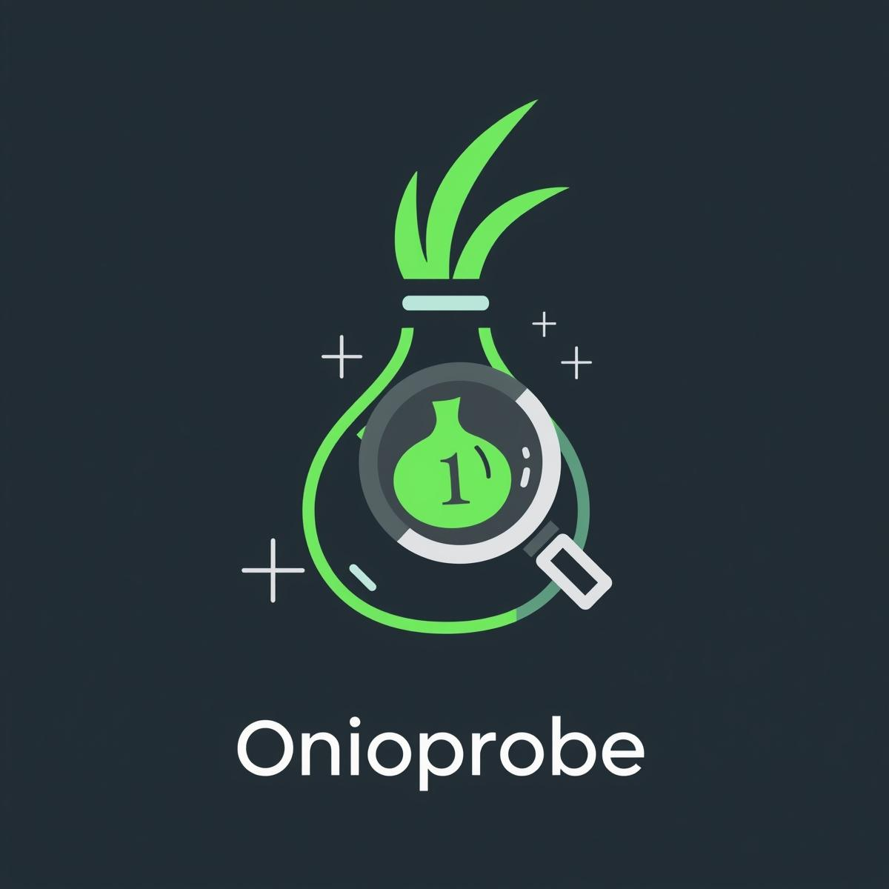

<p align="center">
  
</p>

# 🧅 OnioProbe

OnioProbe

OnioProbe is a **browser extension + backend scanner** that detects **OWASP Top 10 vulnerabilities** and discovers hidden **.onion links** inside web pages.  
It integrates with **OWASP ZAP API** for vulnerability scanning and can optionally route traffic through **Tor**.

---

Features
- 🔍 Passive & Active scanning modes (choose based on need).  
- 🛡 Detects OWASP Top 10 issues (SQLi, XSS, Missing Headers, CSRF, etc).  
- 🧅 Finds hidden `.onion` links in fetched HTML and ZAP spider results.  
- 📊 Quick summary in the Chrome extension popup.  
- 📥 Detailed JSON report downloadable after each scan.  
- ⚡ Works on Windows, Linux, and macOS.

---

📂 Project Structure
```

OnioProbe/
├─ Backend/        # Flask API + Scanner (Python)
│   ├─ app\_async.py
│   ├─ scanner.py
│   ├─ requirements.txt
│   └─ reports/   # scan reports saved here
└─ Extension/      # Chrome extension
├─ manifest.json
├─ popup.html
├─ pop.js
├─ styles.css
└─ icon.png

````

---

⚡ Installation & Setup

### 1. Prerequisites
- Python 3.8+  
- [OWASP ZAP](https://www.zaproxy.org/download/)  
- (Optional) [Tor Browser](https://www.torproject.org/download/) or Tor Expert Bundle  
- Google Chrome / Chromium browser  

---

2. Backend Setup

#### Windows (PowerShell)
```powershell
cd D:\OnioProbe\Backend

# Create virtual environment
python -m venv venv
.\venv\Scripts\Activate.ps1

# Install dependencies
pip install -r requirements.txt

# Set environment variables (adjust with your ZAP API key & Tor port)
$env:ZAP_API_KEY="your_zap_api_key"
$env:ZAP_HOST="127.0.0.1"
$env:ZAP_PORT="8080"
$env:REPORT_DIR="reports"
$env:TOR_SOCKS="socks5h://127.0.0.1:9150"

# Start backend
python app_async.py
````

#### Linux / macOS (bash)

```bash
cd OnioProbe/Backend

python3 -m venv venv
source venv/bin/activate

pip install -r requirements.txt

export ZAP_API_KEY="your_zap_api_key"
export ZAP_HOST="127.0.0.1"
export ZAP_PORT="8080"
export REPORT_DIR="reports"
export TOR_SOCKS="socks5h://127.0.0.1:9050"

python app_async.py
```

Backend runs at:
👉 `http://127.0.0.1:5000`

---

### 3. OWASP ZAP Setup

* Start ZAP GUI or daemon:

  ```bash
  ./zap.sh -daemon -port 8080 -config api.key=your_zap_api_key
  ```
* To scan `.onion` sites: configure ZAP → Options → Connection → Outgoing Proxy → `127.0.0.1:9150` (Tor Browser SOCKS).

---

### 4. Chrome Extension Setup

1. Open Chrome → `chrome://extensions/`
2. Enable **Developer Mode**
3. Click **Load unpacked** → select `OnioProbe/Extension`
4. Extension icon appears in toolbar.

---

### 5. Usage

1. Click extension icon.
2. Enter URL (e.g. `https://testphp.vulnweb.com`).
3. Choose **Passive** (fast) or **Active** (deeper scan).
4. Optionally check **Use Tor**.
5. Click **Scan**.
6. View quick results in popup, or download full report (JSON) for details.

---

## 📊 Reports

* Reports are saved in `Backend/reports/onioprobe_result_<timestamp>.json`.
* They include: target, discovered URLs, onion links, findings with risk & solutions.

---

## ⚠️ Disclaimer

* Use OnioProbe only on systems you **own** or have **explicit permission** to test.
* Scanning unauthorized systems may be illegal.
* Active scans can be intrusive — use with caution.

---

## 🤝 Contributing

Pull requests are welcome. Please open issues to discuss new features or bugs.

---

## 📜 License

MIT License © 2025

```


